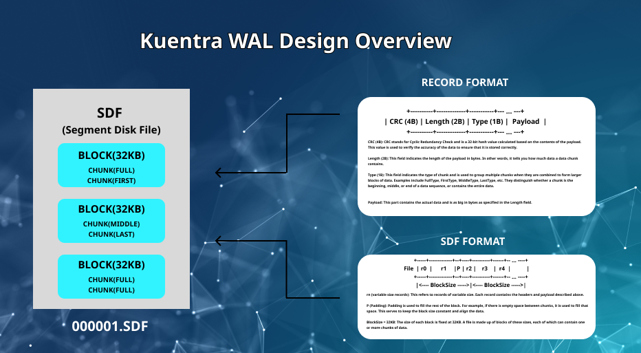

# Kuentra WAL

### Kuentra's Wal has a structure that is easy to understand and can be used for highly available databases.



# Understanding WAL (Write-Ahead Logging) Easily

WAL is not complex. It is simply a way to efficiently store files and read only the necessary data. Understanding the following four principles will enable you to build your own WAL system:

1. `SegSerialID`
2. `BlockNumber`
3. `ChunkOffset`
4. `ChunkSize`

Think of these components as similar to the structural principles of MySQL.

## 1. Segment File Structure

Segment files can exist in multiples and may merge depending on the situation. They internally contain what are known as Blocks.

- Think of a segment as a Shard Table.
- Think of a block as just one of the many tables in a shard.

```sh
+-----------------------------------------------------+
| Segment File (SegmentID = 1)                        |
+-----------------------------------------------------+
| Block 0               | Block 1               | ... |
+-----------------------+-----------------------+-----+
```

## 2. Concept of Chunks in a Block

A block is composed of one or more chunks, akin to how a table contains one or more rows.

```sh
+-----------------------+
| Block 0               |
+-----------------------+
| Chunk 0 | Chunk 1 | ...|
+---------+---------+----+
```

Each chunk is distinguished by `ChunkOffset` and `ChunkSize`, which you should not see as a single row but rather as `limit` and `offset`.

```sh
+-----------------------+
| Block 0               |
+-----------------------+
| C0      | C1      | C2 |
+---------+---------+----+
| Offset 0| Offset X| ...|
+---------+---------+----+
| Size Y  | Size Z  | ...|
+---------+---------+----+
```

Consider this concept as inserting many documents into each shard table. The `ChunkOffset` represents the starting position of the document you are looking for, and `ChunkSize` represents the number of pages to the end. For instance, if a document starts at 0 and has 100 pages, it would be similar to the following SQL query:

```sql
SELECT * FROM SHARD_TABLE1 WHERE BLOCK_ID=0 OFFSET 0 LIMIT 100
```

The same concept applies when writing data:

```sh
+-----------------------+
| Block 0               |
+-----------------------+
| C0      | C1      | C2 |
+---------+---------+----+
| Data    | Data    | Data|
+---------+---------+----+
```

By knowing which shard table (SegSerialID) to insert into, the location, and the length, WAL can efficiently manage and retrieve data quickly and securely.
